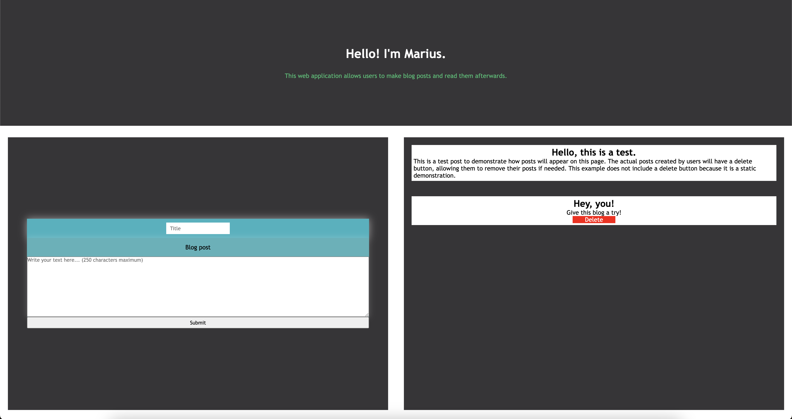

# Blog Post Application

[](#)
> A one-page web app where users can create, view, and delete blog posts. Data is stored securely in a MySQL database to ensure persistence.

## Overview

The **Blog Post Application** is designed for simple blog management, allowing users to write and manage their blog posts dynamically. This application is built using **Node.js, Express, MySQL, and EJS,** ensuring a seamless user experience with a clean and responsive UI.

## Preview

<p align="center">
  
</p>

## Features

- **Create, Read, and Delete Blog Posts:** Users can submit blog posts, view them dynamically, and delete them when needed.
- **MySQL Database Storage:** Ensures that all blog posts persist in the database for reliable data management.
- **Dynamic Templating:** Uses **EJS** to render content dynamically on the frontend.
- **Responsive UI:** Designed with CSS to provide a clean and visually appealing experience.

## Live Demo

**Explore the live version here:** [View Live Demo](https://marius-bogdan.com/projects/blog-post/)

## Local Setup

1. **Clone** the repository:
   ```bash
   git clone https://github.com/MIBogdan/blog-post.git
   ```
2. **Import the database:** 
- Import the `secrets` file into MySQL. This will automatically create the `blog` database and populate it with the necessary data.


3. **Ensure your MySQL credentials match the following** (as used in `index.js`):
- **Username**: `root`
- **Host**: `localhost`
- **Database**: `blog`
- **Password**: (leave empty if not set)


4. **Install** dependencies:
   ```bash
   npm install
   ```

5. **Run** the application:
   ```bash
   npm start
   ```
- The development server will open automatically in your default browser.
- **If it doesn't open automatically**,manually visit: http://localhost:3000 in your browser.

6. **Terminate** the server:
- **On macOS/Linux:** Press `Control + C` in the terminal. 
- **On Windows:** Press `Ctrl + C` in the Command Prompt or PowerShell. 
---

## Author

**Marius Bogdan**  
[Personal portfolio](https://marius-bogdan.com/)

Feel free to reach out for any questions or collaborations!

## License

This project is provided for testing and demonstration purposes only. All rights are reserved. No part of this project may be redistributed, reuploaded, or used in any manner (commercially or otherwise) without explicit written permission from the author.
